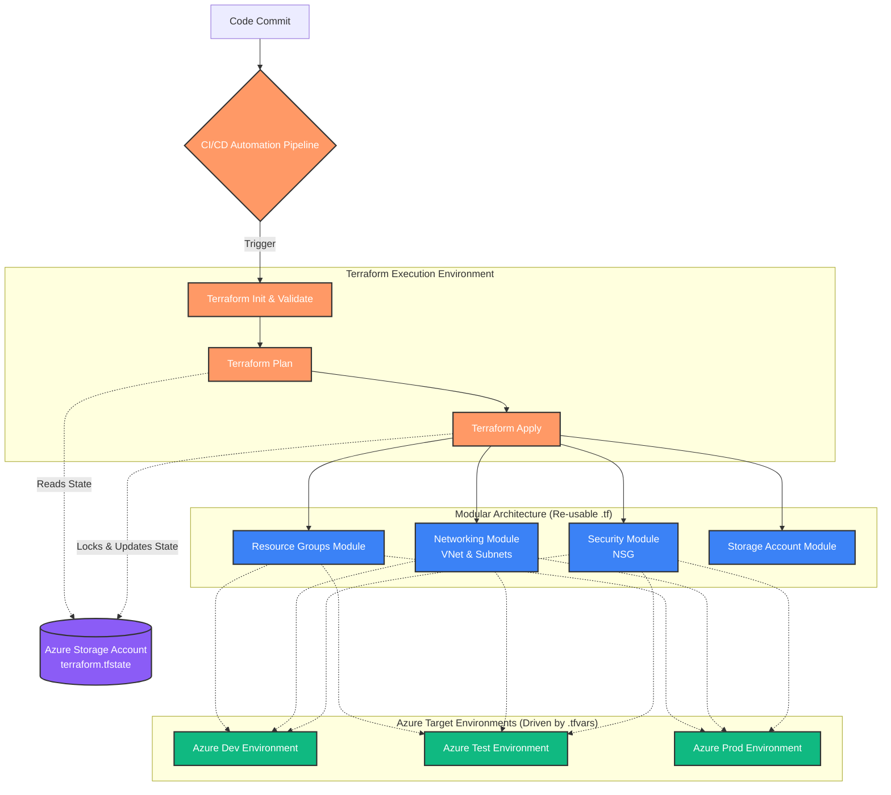

# 🏗️ Terraform Modules — Azure Infrastructure (2026)

> A modular, enterprise-grade Terraform framework for provisioning **Microsoft Azure** infrastructure across multiple environments. Built by **Ashish Kashyap**.

---

## 📁 Repository Structure

```
terraform_Modules_2026/
├── Resource_Group/          # ✅ Active — RG, NSG, VNet modules
│   ├── main.tf              # Core resource definitions
│   ├── variable.tf          # Typed variable declarations
│   ├── terraform.tfvars     # Environment-specific data inputs
│   ├── provider.tf          # AzureRM provider config (v4.68.0)
│   └── terraform.tfstate    # Managed state file
│
└── Storage_Account/         # 🚧 In Progress — Storage Account module
    └── main.tf
```

---

## 🗺️ Project Roadmap

- [x] **Resource Group Module** — Multi-env RGs via `count` and `for_each`
- [x] **Network Security Group (NSG)** — Dynamic security rules via `dynamic` blocks
- [x] **Virtual Network (VNet)** — Dynamic subnets with NSG association
- [ ] **Storage Account Module** — Standard LRS storage provisioning
- [ ] **Expanded Resource Modules** — AKS, Key Vault, Databases
- [ ] **Environment Segregation** — Remote state with Azure Blob backend per environment
- [ ] **CI/CD Automation** — GitHub Actions / Azure DevOps pipelines for hands-free provisioning

---

## 🏛️ Architecture & Workflow



---

## ⚙️ Module Details

### 1. Resource Group (`Resource_Group/`)

Provisions Azure Resource Groups using **two meta-argument patterns** — both demonstrated side by side for learning and comparison.

| Resource | Pattern | Description |
|---|---|---|
| `azurerm_resource_group.rg_block_Count` | `count` | Creates 2 RGs for `dev` and `prod` using indexed list variables |
| `azurerm_resource_group.rg_block_forEach` | `for_each` | Creates RGs dynamically from a typed `map(object(...))` |
| `azurerm_network_security_group.nsg_hcl` | `for_each` + `dynamic` | Creates one NSG per VNet with N security rules via a dynamic block |
| `azurerm_virtual_network.vnet_block_forEach` | `for_each` + `dynamic` | Creates VNets with dynamically defined subnets, each NSG-associated |

**Provider:** `hashicorp/azurerm` `v4.68.0`

**Key variable structure (`vnet_hcl`):**
```hcl
vnet_hcl = {
  v1 = {
    name          = "hcl-dev"
    location      = "central india"
    address_space = ["10.0.0.0/16"]
    dns_servers   = ["10.0.0.4", "10.0.0.5"]

    subnet = {
      subnet1 = { name = "frontend", address_prefixes = ["10.0.1.0/24"], ... }
      subnet2 = { name = "backend",  address_prefixes = ["10.0.2.0/24"], ... }
    }

    security_rule = {
      rule1 = { name = "rule1", priority = 100, direction = "Inbound", ... }
      rule2 = { name = "rule2", priority = 200, direction = "Inbound", ... }
    }
  }
}
```

**Deployed environments (from `terraform.tfvars`):**

| Key | VNet Name | Location | Subnets |
|---|---|---|---|
| `v1` | `vnet-hcl-dev` | Central India | `frontend` (10.0.1.0/24), `backend` (10.0.2.0/24) |
| `v2` | `vnet-hcl-test` | West US | `frontend` (10.0.1.0/24), `backend` (10.0.2.0/24) |

---

### 2. Storage Account (`Storage_Account/`)

> 🚧 **In Progress** — Scaffold exists; active resource definition coming soon.

Will provision `azurerm_storage_account` with `Standard_LRS` replication, tagged per environment.

---

## 🧑‍💻 Engineering Practices & Code Style

This repository enforces enterprise-grade Terraform patterns:

| Pattern | Where Used | Why |
|---|---|---|
| `for_each` over `count` | RG, NSG, VNet | Avoids index-shift destruction on list reorders |
| `dynamic` blocks | NSG security rules, VNet subnets | Scales N rules/subnets from data — zero hardcoding |
| Typed `map(object(...))` variables | `variable.tf` | Schema enforcement + IDE/validation support |
| `lifecycle { ignore_changes }` | RG `managed_by` | Prevents drift from out-of-band Azure Portal changes |
| `depends_on` (explicit) | NSG → RG, VNet → NSG | Guarantees correct resource creation order |
| `.tfvars`-driven inputs | All modules | Logic is never touched per environment — only data changes |

---

## 🛠️ Prerequisites

| Tool | Version | Link |
|---|---|---|
| Terraform | v1.x or later | [Download](https://developer.hashicorp.com/terraform/downloads) |
| Azure CLI | Latest | [Download](https://docs.microsoft.com/en-us/cli/azure/install-azure-cli) |
| Azure Subscription | Active | [Portal](https://portal.azure.com) |

---

## 🏃‍♂️ Getting Started

**1. Login to Azure:**
```bash
az login
```

**2. Navigate to the module:**
```bash
cd Resource_Group
```

**3. Initialize Terraform** (downloads provider plugins):
```bash
terraform init
```

**4. Validate configuration:**
```bash
terraform validate
```

**5. Preview the execution plan:**
```bash
terraform plan
```

**6. Apply and provision:**
```bash
terraform apply
```

> 💡 **Tip:** Pass environment-specific overrides using `-var-file`:
> ```bash
> terraform apply -var-file="prod.tfvars"
> ```

---

## 🧹 Cleanup

Destroy all provisioned resources to avoid unnecessary Azure charges:
```bash
terraform destroy
```

---

## 📌 Notes

- The `default` Terraform workspace is currently active.
- State is managed locally via `terraform.tfstate`. Remote backend (Azure Blob Storage) is planned as part of the CI/CD milestone.
- The `managed_by` field on RGs created via `count` uses `lifecycle { ignore_changes }` to prevent conflicts with existing Azure-managed values (`Devops_Bhagwa`).

---

*Last updated: May 2026 · Author: Ashish Kashyap*