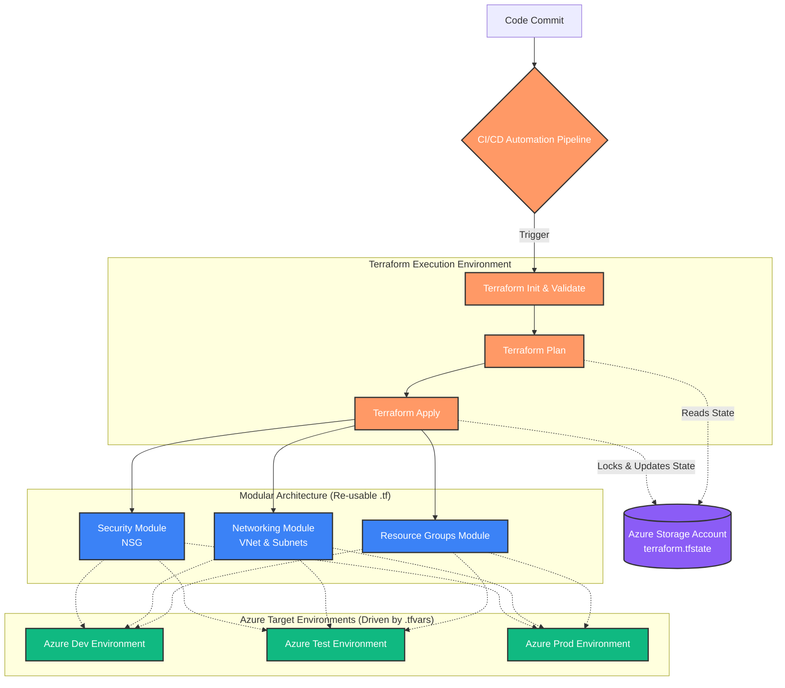

# Terraform Modules

Welcome to the Terraform Modules repository! This project is being built to house a comprehensive suite of reusable, scalable Terraform modules for various Microsoft Azure resources. 

The ultimate goal of this repository is to create a fully automated infrastructure-as-code (IaC) ecosystem, complete with CI/CD pipelines to deploy infrastructure consistently across multiple environments (Dev, Test, Prod).

## 🗺️ Project Roadmap

- [x] **Foundation Modules**: Create base modules for core resources (Resource Groups, VNets, NSGs).
- [ ] **Expanded Resource Modules**: Develop additional modular configurations for complex Azure resources (e.g., AKS, Storage Accounts, Databases).
- [ ] **Environment Segregation**: Standardize state management for strict environment-wise deployments.
- [x] **CI/CD Automation**: Implement deployment pipelines (e.g., GitHub Actions, Azure DevOps, GitLab CI) for automated, hands-free infrastructure provisioning.

## 🏛️ Architecture & Workflow

The diagram below illustrates the intended CI/CD automated workflow, mapping our reusable Terraform modules to completely isolated Azure environments.



## 🧑‍💻 Engineering Practices & Code Style

This repository enforces high-level Terraform engineering standards to ensure flexibility, maintainability, and enterprise-grade deployment patterns. If you are reviewing this code, you will notice the following advanced patterns:

- **Heavy use of `for_each`**: Overcoming the limitations of `count` (such as index shifting), infrastructure iteration is handled elegantly via `for_each` using strongly typed map objects.
- **Highly Parameterized (Variablised)**: Modules are entirely driven by robust `variable.tf` object structures and `.tfvars` files. You can deploy across massive multi-environment setups (Dev, Test, Prod) purely by altering data inputs, never the core `.tf` logic.
- **Dynamic Blocks**: Complex nested resource configurations (like multiple network subnets, security rules, etc.) utilize `dynamic` blocks to scale dynamically and prevent hardcoding.
- **Built-in Functions**: Frequent, intelligent use of native Terraform functions (like `cidrsubnet()`) to calculate mathematical attributes (like IP CIDR ranges) on the fly.
- **Modular Architecture**: Code is written to be strictly decoupled. Business logic is separated from environment data, making the modules perfectly primed for scalable CI/CD automation pipelines.


## 🛠 Prerequisites

Before you begin, ensure you have the following installed:
- [Terraform](https://developer.hashicorp.com/terraform/downloads) (v1.x or later)
- [Azure CLI](https://docs.microsoft.com/en-us/cli/azure/install-azure-cli)
- An active Microsoft Azure Subscription

## 🏃‍♂️ Getting Started

1. **Login to Azure:**
   ```bash
   az login
   ```

2. **Initialize Terraform:**
   Navigate to the target module directory and download the necessary provider plugins:
   ```bash
   cd <module-directory>
   terraform init
   ```

3. **Validate Configuration:**
   Ensure your code is syntactically correct:
   ```bash
   terraform validate
   ```

4. **Review Execution Plan:**
   See exactly what Terraform will create, modify, or destroy:
   ```bash
   terraform plan
   ```

5. **Deploy Infrastructure:**
   Apply the configuration to provision the resources in Azure:
   ```bash
   terraform apply
   ```

## 🧹 Cleanup

To avoid incurring unnecessary charges, remember to destroy all provisioned infrastructure once you are done testing:
```bash
terraform destroy
```