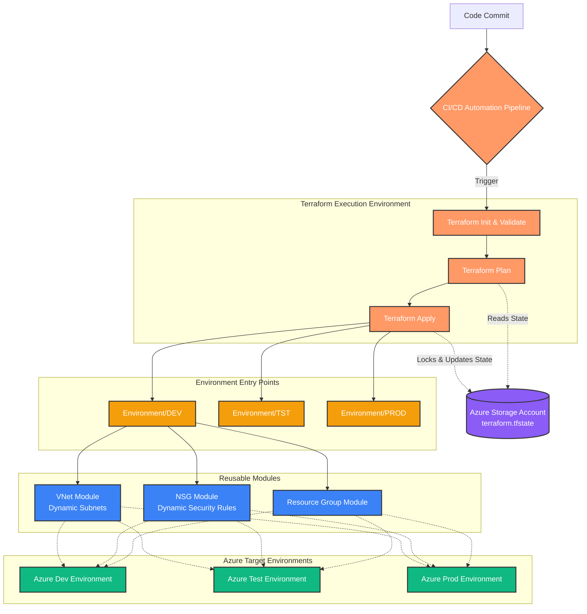

# 🏗️ Terraform Modules — Azure Infrastructure (2026)

> A modular, enterprise-grade Terraform framework for provisioning **Microsoft Azure** infrastructure across multiple environments. Built by **Ashish Kashyap**.

---

## 📁 Repository Structure

```
terraform_Modules_2026/
│
├── Environment/                     # 🌍 Environment-specific entry points
│   ├── DEV/                         # ✅ Active — Development environment
│   │   ├── main.tf                  # Module orchestration (RG → NSG → VNet)
│   │   ├── var.tf                   # Typed variable declarations
│   │   ├── terraform.tfvars         # DEV-specific data inputs
│   │   └── provider.tf              # AzureRM provider config (v4.73.0)
│   ├── TST/                         # 🔜 Planned — Test environment
│   └── PROD/                        # 🔜 Planned — Production environment
│
├── Resource_Group/                  # ✅ Module — Azure Resource Groups
│   ├── main.tf                      # azurerm_resource_group (for_each)
│   └── var.tf                       # Typed variable declarations
│
├── NSG/                             # ✅ Module — Network Security Groups
│   ├── main.tf                      # azurerm_network_security_group + dynamic rules
│   └── var.tf                       # Typed variable declarations
│
├── VNET/                            # ✅ Module — Virtual Networks & Subnets
│   ├── main.tf                      # azurerm_virtual_network + dynamic subnets
│   └── var.tf                       # Typed variable declarations
│
├── Terraform.drawio                 # Architecture diagram source
└── README.md
```

---

## 🗺️ Project Roadmap

- [x] **Resource Group Module** — Multi-env RGs via `for_each`
- [x] **Network Security Group (NSG)** — Dynamic security rules via `dynamic` blocks
- [x] **Virtual Network (VNet)** — Dynamic subnets with NSG association
- [x] **Modular Architecture** — Separate reusable modules orchestrated from `Environment/DEV`
- [ ] **TST & PROD Environments** — Replicate DEV pattern for test and production
- [ ] **Storage Account Module** — Standard LRS storage provisioning
- [ ] **Expanded Resource Modules** — AKS, Key Vault, Databases
- [ ] **Remote State Backend** — Azure Blob Storage backend per environment
- [ ] **CI/CD Automation** — GitHub Actions / Azure DevOps pipelines for hands-free provisioning

---

## 🏛️ Architecture & Workflow



---

## ⚙️ Module Details

### 1. Resource Group (`Resource_Group/`)

Provisions Azure Resource Groups dynamically using `for_each` over a typed `map(object(...))`.

| Resource | Pattern | Description |
|---|---|---|
| `azurerm_resource_group.rg_block_forEach` | `for_each` | Creates RGs dynamically from a `map(object(...))` — keyed by logical name |

**Key variable structure (`rgName`):**
```hcl
rgName = {
  rg1 = { name = "rg-hcl-dev",  location = "west us"      }
  rg2 = { name = "rg-hcl-test", location = "central india" }
}
```

---

### 2. Network Security Group (`NSG/`)

Provisions one NSG per entry using `for_each`, with N security rules rendered via a `dynamic "security_rule"` block.

| Resource | Pattern | Description |
|---|---|---|
| `azurerm_network_security_group.nsg_hcl` | `for_each` + `dynamic` | One NSG per map key; rules expand from nested `security_rule` map |

**Key variable structure (`nsg`):**
```hcl
nsg = {
  nsg1 = {
    name     = "nsg-hcl-dev"
    location = "central india"
    security_rule = {
      rule1 = { name = "rule1", priority = 100, direction = "Inbound", protocol = "Tcp", ... }
      rule2 = { name = "rule2", priority = 200, direction = "Inbound", protocol = "Tcp", ... }
    }
  }
}
```

---

### 3. Virtual Network (`VNET/`)

Provisions VNets with dynamically defined subnets, each associated with an NSG.

| Resource | Pattern | Description |
|---|---|---|
| `azurerm_virtual_network.vnet_block_forEach` | `for_each` + `dynamic` | VNets with N subnets from nested `subnet` map |

**Key variable structure (`vnet_hcl`):**
```hcl
vnet_hcl = {
  v1 = {
    name          = "hcl-dev"
    location      = "central india"
    address_space = ["10.0.0.0/16"]
    dns_servers   = ["10.0.0.4", "10.0.0.5"]
    subnet = {
      subnet1 = { name = "frontend", address_prefixes = ["10.0.1.0/24"], security_group = "nsg-hcl-dev" }
      subnet2 = { name = "backend",  address_prefixes = ["10.0.2.0/24"], security_group = "nsg-hcl-dev" }
    }
  }
}
```

**Deployed environments (from `terraform.tfvars`):**

| Key | VNet Name | Location | Subnets |
|---|---|---|---|
| `v1` | `vnet-hcl-dev` | Central India | `frontend` (10.0.1.0/24), `backend` (10.0.2.0/24) |
| `v2` | `vnet-hcl-test` | West US | `frontend` (10.0.1.0/24), `backend` (10.0.2.0/24) |

---

### 4. Environment Orchestration (`Environment/DEV/`)

The `main.tf` in each environment directory wires the reusable modules together with explicit `depends_on` ordering:

```hcl
module "rg"   { source = "../../Resource_Group" }
module "nsg"  { source = "../../NSG"  depends_on = [module.rg]  }
module "vnet" { source = "../../VNET" depends_on = [module.nsg] }
```

This guarantees the creation order: **RG → NSG → VNet**.

---

## 🧑‍💻 Engineering Practices & Code Style

| Pattern | Where Used | Why |
|---|---|---|
| `for_each` over `count` | RG, NSG, VNet | Avoids index-shift destruction on list reorders |
| `dynamic` blocks | NSG security rules, VNet subnets | Scales N rules/subnets from data — zero hardcoding |
| Typed `map(object(...))` variables | All module `var.tf` files | Schema enforcement + IDE/validation support |
| `lifecycle { ignore_changes }` | RG `managed_by` | Prevents drift from out-of-band Azure Portal changes |
| `depends_on` (explicit) | NSG → RG, VNet → NSG | Guarantees correct resource creation order |
| `.tfvars`-driven inputs | All environments | Logic is never touched per environment — only data changes |
| Separate module directories | `NSG/`, `VNET/`, `Resource_Group/` | Each module is independently reusable across TST/PROD |

---

## 🛠️ Prerequisites

| Tool | Version | Link |
|---|---|---|
| Terraform | v1.x or later | [Download](https://developer.hashicorp.com/terraform/downloads) |
| Azure CLI | Latest | [Download](https://docs.microsoft.com/en-us/cli/azure/install-azure-cli) |
| Azure Subscription | Active | [Portal](https://portal.azure.com) |

---

## 🏃‍♂️ Getting Started

**1. Login to Azure:**
```bash
az login
```

**2. Navigate to the DEV environment:**
```bash
cd Environment/DEV
```

**3. Initialize Terraform** (downloads provider plugins):
```bash
terraform init
```

**4. Validate configuration:**
```bash
terraform validate
```

**5. Preview the execution plan:**
```bash
terraform plan
```

**6. Apply and provision:**
```bash
terraform apply
```

> 💡 **Tip:** To target a different environment, navigate to its directory and use the same workflow:
> ```bash
> cd Environment/TST
> terraform init && terraform plan
> ```

---

## 🧹 Cleanup

Destroy all provisioned resources to avoid unnecessary Azure charges:
```bash
terraform destroy
```

---

## 📌 Notes

- The `default` Terraform workspace is currently active.
- State is managed locally via `terraform.tfstate`. Remote backend (Azure Blob Storage) is planned as part of the CI/CD milestone.
- The `managed_by` field on Resource Groups uses `lifecycle { ignore_changes }` to prevent conflicts with existing Azure-managed values.
- Provider: `hashicorp/azurerm` **v4.73.0**

---

*Last updated: May 2026 · Author: Ashish Kashyap*